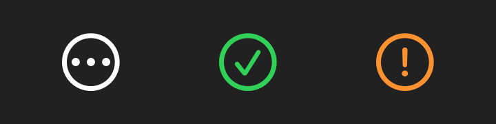

# Perch

A tiny macOS menu bar icon hider. Click any empty space in the menu bar to hide or show your clutter icons. There's no chevron and nothing extra in the bar.

## How it works

Perch adds one thin divider to the menu bar. Any icon you ⌘-drag to the **left** of the divider is hidden when Perch collapses. The divider stretches to a huge width and pushes those icons off-screen. A global click monitor watches for clicks on empty menu bar space (not on app menus or icons) and toggles between hidden and shown.

## Build

Requires the Xcode command line tools (macOS 13+).

```bash
./build.sh
mv Perch.app /Applications/ && open /Applications/Perch.app
```

On first launch, grant **Accessibility** access (System Settings → Privacy & Security → Accessibility) so Perch can tell empty bar space apart from app menus. Without it, Perch falls back to only toggling on clicks in the right half of the screen.

## Usage

- **Click empty menu bar space:** hide or show icons
- **Right-click empty menu bar space:** settings (launch at login, quit)
- **⌘-drag icons** left of the divider to choose what gets hidden. Drag the divider all the way right to hide everything.

The app is ad-hoc signed. If you rebuild it, macOS may reset the Accessibility permission, so toggle it off and on again.

## Claude Code status icon



Perch can also show a small icon while Claude Code works in Cursor: animated dots while it's working, a green ✓ when it's done, and an orange ! when it needs you. The icon disappears when there's nothing to report. Click it to jump to that project in Cursor (and clear the ✓). Right-click it to list every session and open any of them.

Setup:

```bash
mkdir -p ~/.perch && cp claude-status.sh ~/.perch/
```

Then add these hooks to `~/.claude/settings.json`:

```json
"hooks": {
  "UserPromptSubmit": [{ "hooks": [{ "type": "command", "command": "~/.perch/claude-status.sh working 2>/dev/null || true", "timeout": 5 }] }],
  "Stop":             [{ "hooks": [{ "type": "command", "command": "~/.perch/claude-status.sh done 2>/dev/null || true", "timeout": 5 }] }],
  "Notification":     [{ "hooks": [{ "type": "command", "command": "~/.perch/claude-status.sh attention 2>/dev/null || true", "timeout": 5 }] }],
  "PostToolUse":      [{ "hooks": [{ "type": "command", "command": "~/.perch/claude-status.sh working 2>/dev/null || true", "timeout": 5, "async": true }] }],
  "SessionEnd":       [{ "hooks": [{ "type": "command", "command": "~/.perch/claude-status.sh end 2>/dev/null || true", "timeout": 5 }] }]
}
```

The script only reports sessions running in Cursor. Delete the `__CFBundleIdentifier` line in it to report every session. To use your own image for "done", save it as `~/.perch/icon.png`. If the icon gets hidden when the bar collapses, ⌘-drag it to the right of the divider.
